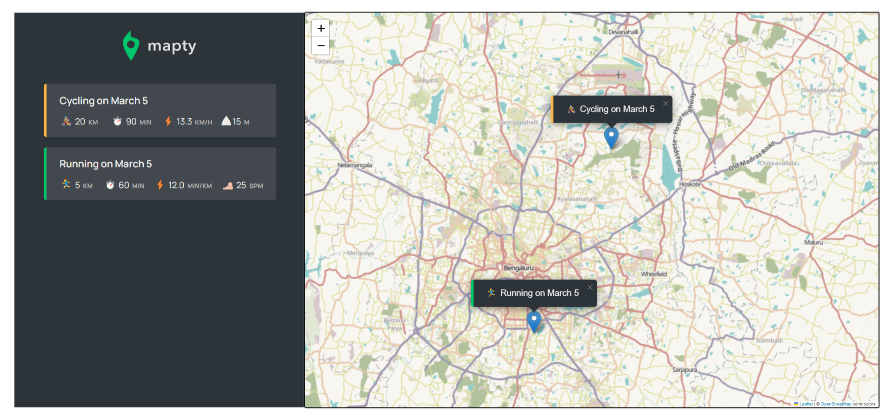

<h1 align="center">Mapty App</h1>
<p align="center">
    
 </p>

<h2 align="center">
Check out the <a href="https://srichandan-09.github.io/Mapty-App-JS/" target="_blank">live Mapty App here</a>.
</h2>
<p align="left">
  Mapty is a map application made with Vanilla JavaScript to store workouts like running and cycling.
  Discover the ultimate workout tracking tool with Mapty - a unique application that utilizes a huge map to log your exercise routes.
</p>


## Features

The user can choose any point on the map and choose between running or cycling. In order to submit the workout, the user needs to fill out several details like distance, duration, cadence or elevation. All the workout will be saved after choosing any new workout option. The user is able to find the workout on the map by clicking on the list. The list contains workout details like pace, cadence, duration, speed as well as the date of the workout. If the user reloads the page, all the data will be saved.
- Real time geolocation update.
- Custom map by leaflet API.
- Ability to log a workout(Running or Cycling) to specific location.
- If running workout then user can set his/her workout distance, duration, cadence ,then application check the data validation and calculate the pace.
- If workout is cycling then user can set his/her workout distance, duration, elevation gain then application check the data validation and calculate the speed.
- All the workout information will appear in a workout list.
- A Map marker will also set on the map for specific workout with date and workout type.
- User can click on the workout to move the marker to see his/her different workout info on the map.
- All the workout information will save in the localstorage so that application will not loose its stat in case browser is load. Ability to delete all workouts.

## Built with

- JavaScript
- CSS3
- HTML5
- Leaflet Api

<h2 id="screenshots">Project Screenshot</h2>

<p>Feel free to check out the screenshot of my website for a sneak peek into its captivating user interface.</p>

<p align="center">
  
</p>

## Installation

- Clone this repo:

```sh
git clone https://github.com/Srichandan-09/Mapty-App-JS.git
```

- Install dependencies:

```sh
npm install
```

- Run the app:

```sh
npm start
```

## Author

<b>👤 Srichandan</b>

- LinkedIn - [@Srichandan](https://www.linkedin.com/in/srichandan09)
- Github: [@Srichandan-09](https://github.com/Srichandan-09)

Feel free to contact me with any questions or feedback!

## Show your support

Give a ⭐️ if you liked this project!
